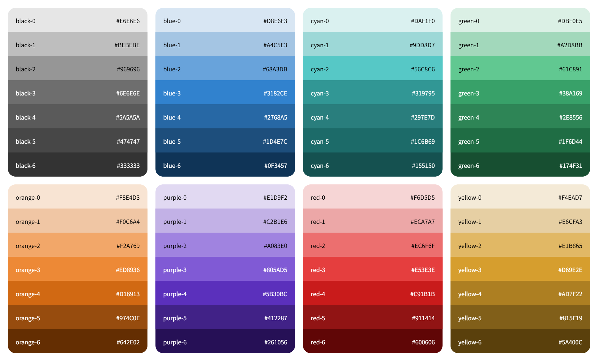

# rise-design-colors

Rise Design 颜色库

## Demo



## Install

```bash
# NPM
npm install @rise-design/colors

# YARN
yarn add @rise-design/colors

# PNPM
pnpm add @rise-design/colors
```

## Usage

```ts
import {
  red,
  orange,
  yellow,
  green,
  cyan,
  blue,
  purple,
  gray
} from '@rise-design/colors'

console.log(red.base) // #E53E3E
console.log(red.colors) // [#F6D5D5, #ECA7A7, #EC6F6F, #E53E3E, #C91B1B, #911414, #600606]
```

```less
@import '@rise-design/colors/css/variables.css';

/* 基色系 */
@color-red-base: var(--rd-color-red-base);
@color-orange-base: var(--rd-color-orange-base);
@color-yellow-base: var(--rd-color-yellow-base);
@color-green-base: var(--rd-color-green-base);
@color-cyan-base: var(--rd-color-cyan-base);
@color-blue-base: var(--rd-color-blue-base);
@color-purple-base: var(--rd-color-purple-base);
@color-gray-base: var(--rd-color-gray-base);

/* 红色系 */
@color-red-0: var(--rd-color-red-0);
@color-red-1: var(--rd-color-red-1);
@color-red-2: var(--rd-color-red-2);
@color-red-3: var(--rd-color-red-3);
@color-red-4: var(--rd-color-red-4);
@color-red-5: var(--rd-color-red-5);
@color-red-6: var(--rd-color-red-6);

/* 橙色系 */
@color-orange-0: var(--rd-color-orange-0);
@color-orange-1: var(--rd-color-orange-1);
@color-orange-2: var(--rd-color-orange-2);
@color-orange-3: var(--rd-color-orange-3);
@color-orange-4: var(--rd-color-orange-4);
@color-orange-5: var(--rd-color-orange-5);
@color-orange-6: var(--rd-color-orange-6);

/* 黄色系 */
@color-yellow-0: var(--rd-color-yellow-0);
@color-yellow-1: var(--rd-color-yellow-1);
@color-yellow-2: var(--rd-color-yellow-2);
@color-yellow-3: var(--rd-color-yellow-3);
@color-yellow-4: var(--rd-color-yellow-4);
@color-yellow-5: var(--rd-color-yellow-5);
@color-yellow-6: var(--rd-color-yellow-6);

/* 绿色系 */
@color-green-0: var(--rd-color-green-0);
@color-green-1: var(--rd-color-green-1);
@color-green-2: var(--rd-color-green-2);
@color-green-3: var(--rd-color-green-3);
@color-green-4: var(--rd-color-green-4);
@color-green-5: var(--rd-color-green-5);
@color-green-6: var(--rd-color-green-6);

/* 青色系 */
@color-cyan-0: var(--rd-color-cyan-0);
@color-cyan-1: var(--rd-color-cyan-1);
@color-cyan-2: var(--rd-color-cyan-2);
@color-cyan-3: var(--rd-color-cyan-3);
@color-cyan-4: var(--rd-color-cyan-4);
@color-cyan-5: var(--rd-color-cyan-5);
@color-cyan-6: var(--rd-color-cyan-6);

/* 蓝色系 */
@color-blue-0: var(--rd-color-blue-0);
@color-blue-1: var(--rd-color-blue-1);
@color-blue-2: var(--rd-color-blue-2);
@color-blue-3: var(--rd-color-blue-3);
@color-blue-4: var(--rd-color-blue-4);
@color-blue-5: var(--rd-color-blue-5);
@color-blue-6: var(--rd-color-blue-6);

/* 紫色系 */
@color-purple-0: var(--rd-color-purple-0);
@color-purple-1: var(--rd-color-purple-1);
@color-purple-2: var(--rd-color-purple-2);
@color-purple-3: var(--rd-color-purple-3);
@color-purple-4: var(--rd-color-purple-4);
@color-purple-5: var(--rd-color-purple-5);
@color-purple-6: var(--rd-color-purple-6);

/* 中性灰 */
@color-gray-0: var(--rd-color-gray-0);
@color-gray-1: var(--rd-color-gray-1);
@color-gray-2: var(--rd-color-gray-2);
@color-gray-3: var(--rd-color-gray-3);
@color-gray-4: var(--rd-color-gray-4);
@color-gray-5: var(--rd-color-gray-5);
@color-gray-6: var(--rd-color-gray-6);
```

## Scripts

```bash
# 项目启动
pnpm serve

# 项目构建（CommonJS）
pnpm build:cjs

# 项目构建（ES Module）
pnpm build:esm

# 项目构建（CSS）
pnpm build:css

# 项目构建（CommonJS + ES Module + CSS）
pnpm build:all

# 代码检测
pnpm lint

# 代码检测（包含自动修复）
pnpm lint:fix

# 单元测试
pnpm test
```

## Publish

```bash
# 第 1 步：在 develop 分支推送本地代码至远端，提 PR 合并 main 分支
git add .
git commit -m 'feat: 新增 xxx 功能'
git push

# 第 2 步：切换到 main 分支，拉取最新代码
git checkout main
git pull

# 第 3 步：在 main 分支新建 release 分支，升级包版本号（pnpm 自动生成 tag）
git checkout -b release/vx.x.x
pnpm version patch # 1.0.0 -> 1.0.1
pnpm version minor # 1.0.0 → 1.1.0
pnpm version major # 1.0.0 → 2.0.0

# 第 4 步：将 release 分支推送至远端，提 PR 合并 main 分支
git push origin release/vx.x.x

# 第 5 步：切换回 main 分支，拉取最新代码，推送 tags 至远端
git checkout main
git pull
git push origin --tags

# 第 6 步：登录 NPM 官方账号
pnpm login --registry https://registry.npmjs.org

# 第 6 步：发布 NPM 包
pnpm publish
```

## Others

| 颜色阶号 | 建议用途 |
| :---: | :---: |
| 0 | 浅色背景、页面背景 |
| 1 | 轻 hover、卡片底色 |
| 2 | 次要组件、分割线、占位 |
| 3 | 主题色 |
| 4 | 按钮 hover、次要文字 |
| 5 | 强调文字、正文文字 |
| 6 | 深色标签、标题 |
